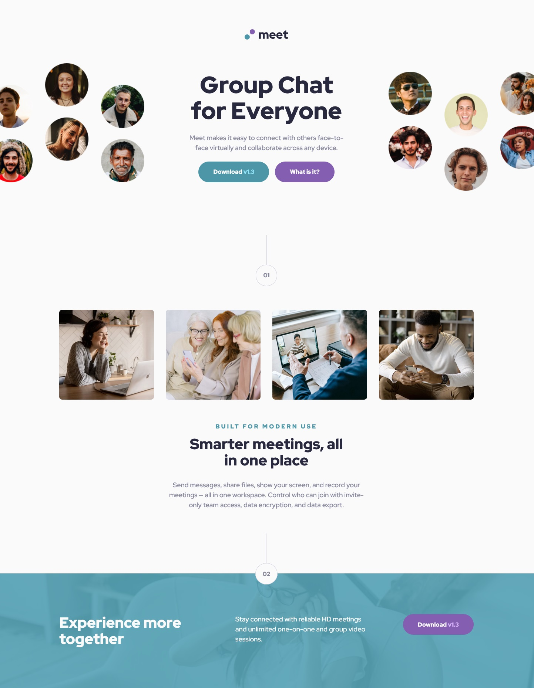
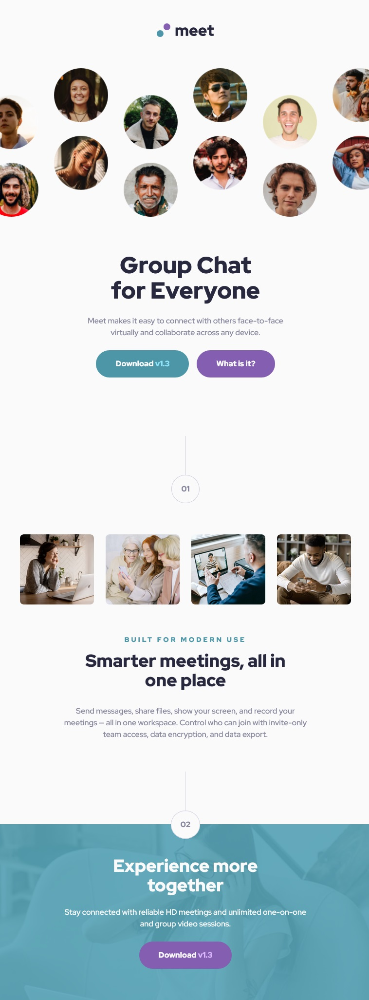

# Frontend Mentor - Meet landing page solution

This is a solution to the [Meet landing page challenge on Frontend Mentor](https://www.frontendmentor.io/challenges/meet-landing-page-rbTDS6OUR). Frontend Mentor challenges help you improve your coding skills by building realistic projects. 

## Table of contents

- [Overview](#overview)
  - [The challenge](#the-challenge)
  - [Screenshot](#screenshot)
  - [Links](#links)
- [My process](#my-process)
  - [Built with](#built-with)
  - [What I learned](#what-i-learned)
  - [Continued development](#continued-development)
  - [Useful resources](#useful-resources)
- [Author](#author)

## Overview

### The challenge

Users should be able to:

- View the optimal layout depending on their device's screen size
- See hover states for interactive elements

### Screenshot

### Links

- Solution URL: [https://github.com/kassahunAmdie/meet-landing-page](https://your-solution-url.com)
- Live Site URL: [https://kassahunamdie.github.io/meet-landing-page/](https://your-live-site-url.com)

## My process

### Built with

- Semantic HTML5 markup
- CSS custom properties
- Flexbox
- CSS Grid
- Mobile-first workflow

### What I learned

For me this was a deep dive into the world of CSS-Grid. I built this challenge with almost only Grid layout. Some of the new things I learned and applied are subgrids, full bleed layout for the hero section pictures. There were many challenges, that led me into a deeper understanding of Grid layouts. My usual resources that I used to find the solutions are listed below.

### Useful resources

- [https://www.joshwcomeau.com/css/full-bleed/](https://www.example.com) - I learned about full bleed layout and how to approach it here with the excellent instructions of Josh Comeau.
- [https://css-tricks.com/snippets/css/complete-guide-grid/](https://www.example.com) - My quick reference for all things CSS
- [https://www.youtube.com/watch?v=6l24PIccgqU&t=800s](https://www.example.com) - Instructional youtube video by Coder Coder. 
- [https://www.youtube.com/@KevinPowell](https://www.example.com) - I would at least watch one instructional video here from Kevin Powell every single day. Loads and Loads of tricks and excellent analysis about good and not so good sides of certain approaches to a project.
- [https://developer.mozilla.org/en-US/](https://www.example.com) - Last but not least is MDN. Can not go with out. 

## Author

- Website - 
- Frontend Mentor - [@kassahunAmdie](https://www.frontendmentor.io/profile/yourusername)

